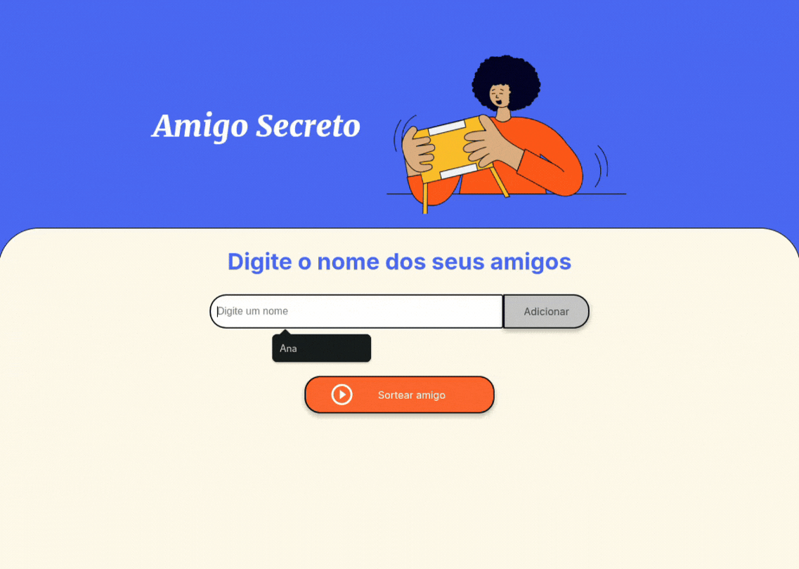

# 👥 Projeto ONE - Challenge "Amigo Secreto"

 

    Este projeto foi desenvolvido como parte do desafio proposto pela formação do <strong>programa ONE (Oracle Next Education)</strong>. A aplicação tem como objetivo permitir que os usuários cadastrem nomes de amigos em uma lista e, posteriormente, realizem um sorteio aleatório para determinar quem será o "amigo secreto".
      
    Para utilizar a aplicação, o usuário deve inserir os nomes no campo designado e clicar no botão "Adicionar". Os nomes cadastrados serão exibidos em uma lista. Ao concluir a inclusão dos participantes, basta clicar no botão "Sortear Amigo", e o sistema selecionará aleatoriamente um dos nomes, exibindo o resultado na tela.

  

## 🚀 Funcionalidades

 
✅ <strong>Adição de nomes:</strong> Os usuários podem inserir o nome de um amigo em um campo de texto e adicioná-lo a uma lista visível ao clicar no botão "Adicionar".  

✅ <strong>Validação de entradas:</strong> Caso o campo de texto esteja vazio ou o sorteio seja realizado sem que nenhum nome tenha sido adicionado previamente, o programa exibirá um alerta solicitando a inserção de um nome válido ou a inclusão de nomes na lista.  

✅ <strong>Visualização da lista:</strong> Os nomes inseridos serão exibidos em uma lista logo abaixo do campo de entrada.  

✅ <strong>Sorteio aleatório:</strong> Ao clicar no botão "Sortear Amigo", um nome será selecionado aleatoriamente da lista e exibido na página.  
 

## 🎮 Como Jogar

 
1️⃣ O usuário deve adicionar os nomes por meio do campo destinado a essa finalidade.
 
2️⃣ Em seguida, clicar no botão <strong>"Adicionar"</strong> para incluir o nome na lista.
 
3️⃣ Os nomes inseridos serão exibidos logo abaixo do campo de entrada.
 
4️⃣ Após inserir todos os participantes, basta clicar no botão <strong>"Sortear Amigo"</strong>.
 
5️⃣ Um nome será escolhido aleatoriamente e exibido na tela como o amigo secreto sorteado.
 
  

## 🛠️ Tecnologias Utilizadas

 
🔹 <strong>HTML</strong> para estrutura da página. 
🔹 <strong>CSS</strong> para estilização. 
🔹 <strong>JavaScript</strong> para lógica do jogo e interação com o usuário. 
  

## 📷 Demonstração

 

  

## 🔗 Como Executar

 
1️⃣ Clone este repositório: <code>git clone https://github.com/ramonmonda/one-challenge-01-amigo-secreto</code> 
2️⃣ Abra o arquivo <strong>index.html</strong> no navegador. 
3️⃣ Ou apenas <a href="https://one-challenge-01-amigo-secreto.vercel.app/">Clique Aqui</a>.   

    <strong>📢 Sinta-se à vontade para contribuir com sugestões e melhorias!</strong>  

